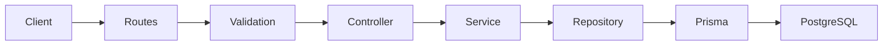
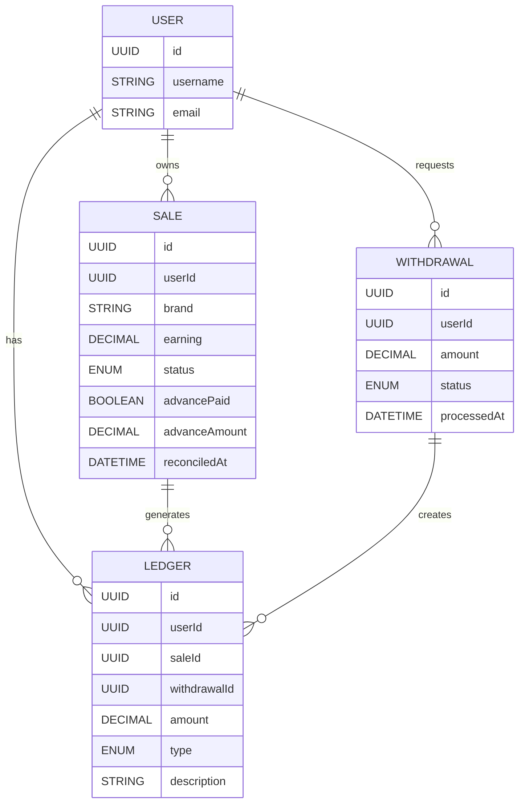
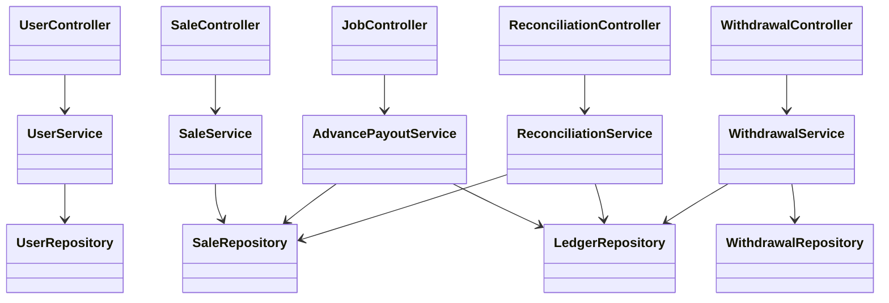
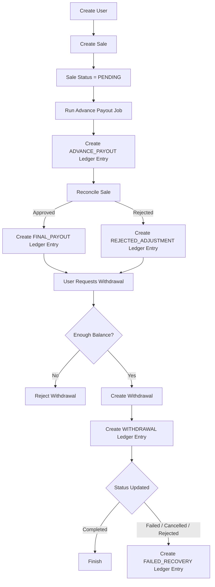

# User Payout Management System - Low Level Design (LLD)

## Overview

The User Payout Management System is a backend application that manages affiliate sales, advance payouts, sale reconciliation, and user withdrawals. The application follows a layered architecture to ensure separation of concerns, maintainability, and scalability.

Instead of storing user balances directly, the system follows a **ledger-based accounting model**, where every financial transaction is recorded as a ledger entry. The available balance is calculated by summing ledger entries, ensuring transparency and auditability.

---

# Technology Stack

| Technology | Purpose |
|------------|---------|
| Node.js | Runtime Environment |
| Express.js | REST API Framework |
| PostgreSQL | Relational Database |
| Prisma ORM | Database Access |
| Zod | Request Validation |
| Jest | Testing Framework |
| Supertest | Integration Testing |

---

# System Architecture



## Layer Responsibilities

### Routes
- Define API endpoints.
- Forward requests to controllers.

### Validation Middleware
- Validate incoming requests using Zod.
- Reject invalid requests before reaching business logic.

### Controllers
- Handle HTTP requests and responses.
- Delegate business logic to services.
- Return appropriate status codes and JSON responses.

### Services
- Contain all business rules.
- Handle payout calculations.
- Perform reconciliation.
- Validate financial operations.
- Manage transactions.

### Repositories
- Interact with Prisma ORM.
- Execute database queries.
- Keep database access separate from business logic.

### Database
- Stores application data.
- Ensures transactional consistency.

---

# Request Flow

## Example: Create Sale

```mermaid
sequenceDiagram

Client->>Routes: POST /api/sales
Routes->>Validation: Validate Request
Validation->>Controller: Valid Request
Controller->>SaleService: createSale()
SaleService->>SaleRepository: create()
SaleRepository->>Prisma: Insert Sale
Prisma->>PostgreSQL: Save Record
PostgreSQL-->>Prisma: Success
Prisma-->>SaleRepository
SaleRepository-->>SaleService
SaleService-->>Controller
Controller-->>Client: 201 Created
```

---

# Database Design



---

# Class Design



---

# Business Workflow



---

# API Endpoints

## User

### Create User

```
POST /api/users
```

Request

```json
{
  "username": "john",
  "email": "john@example.com"
}
```

---

## Sale

### Create Sale

```
POST /api/sales
```

Request

```json
{
  "userId": "<uuid>",
  "brand": "Amazon",
  "earning": 100
}
```

---

## Advance Payout

### Run Advance Payout Job

```
POST /api/jobs/advance-payout
```

No request body required.

---

## Reconciliation

### Reconcile Sale

```
POST /api/reconciliation
```

Request

```json
{
  "saleId": "<uuid>",
  "status": "APPROVED"
}
```

or

```json
{
  "saleId": "<uuid>",
  "status": "REJECTED"
}
```

---

## Withdrawal

### Create Withdrawal

```
POST /api/withdrawals
```

Request

```json
{
  "userId": "<uuid>",
  "amount": 50
}
```

---

### Update Withdrawal Status

```
PATCH /api/withdrawals/:id/status
```

Request

```json
{
  "status": "FAILED"
}
```

Possible values:

- COMPLETED
- FAILED
- CANCELLED
- REJECTED

---

# Edge Cases and Failure Scenarios

## Duplicate User

- Email must be unique.
- Username must be unique.

---

## Invalid User

Sales cannot be created for users that do not exist.

---

## Invalid Withdrawal

Withdrawal requests fail when:

- User balance is insufficient.
- Another withdrawal was created within the last 24 hours.

---

## Duplicate Advance Payout

Advance payouts are idempotent.

Each sale receives the advance only once.

---

## Duplicate Reconciliation

A sale cannot be reconciled multiple times.

---

## Failed Withdrawal

When a withdrawal becomes:

- FAILED
- CANCELLED
- REJECTED

the deducted amount is automatically restored by creating a recovery ledger entry.

---

## Transaction Failures

Financial operations execute inside Prisma transactions.

If any database operation fails:

- Entire transaction rolls back.
- Database consistency is preserved.

---

# Design Decisions

## Layered Architecture

The application follows a layered architecture consisting of:

- Controllers
- Services
- Repositories

This keeps responsibilities well separated and improves maintainability.

---

## Repository Pattern

Repositories isolate database access from business logic.

Benefits:

- Easier testing
- Better maintainability
- Cleaner services

---

## Service Layer

Business logic is centralized inside services.

Controllers remain lightweight and only coordinate requests and responses.

---

## Ledger-Based Accounting

Instead of maintaining a mutable balance field, every financial event is stored as a ledger entry.

Advantages:

- Complete audit trail
- Easier recovery
- Prevents balance inconsistencies
- Simplifies financial reporting

---

## Prisma Transactions

Financial operations update multiple tables.

Transactions ensure:

- Atomicity
- Consistency
- Data integrity

---

## Request Validation

Zod validates every incoming request before it reaches the controller.

This prevents invalid data from entering the business layer.

---

# Trade-offs

- The advance payout job is triggered manually through an API endpoint instead of an automated scheduler. In a production environment, this could be replaced with a scheduled background job using tools such as Cron or BullMQ.
- Authentication and authorization are not included because they were outside the scope of this assignment.
- The project focuses on correctness, financial consistency, and modular architecture rather than production deployment concerns.

---

# Testing

The project includes integration tests using **Jest** and **Supertest**.

Covered scenarios include:

- User creation
- Duplicate user validation
- Sale creation
- Invalid sale creation
- Advance payout processing
- Idempotent advance payout
- Sale reconciliation
- Final payout generation
- Rejected sale adjustment
- Withdrawal creation
- Insufficient balance
- 24-hour withdrawal restriction
- Failed withdrawal recovery
- Cancelled withdrawal recovery
- Rejected withdrawal recovery

**Total Integration Tests:** **17**

All tests pass successfully against a PostgreSQL test database.

---

# Future Improvements

- JWT Authentication
- Role-Based Access Control
- Scheduled background jobs
- Redis caching
- Docker Compose
- CI/CD pipeline using GitHub Actions
- API rate limiting
- Monitoring and logging
- Pagination and filtering for APIs