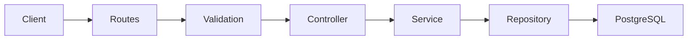
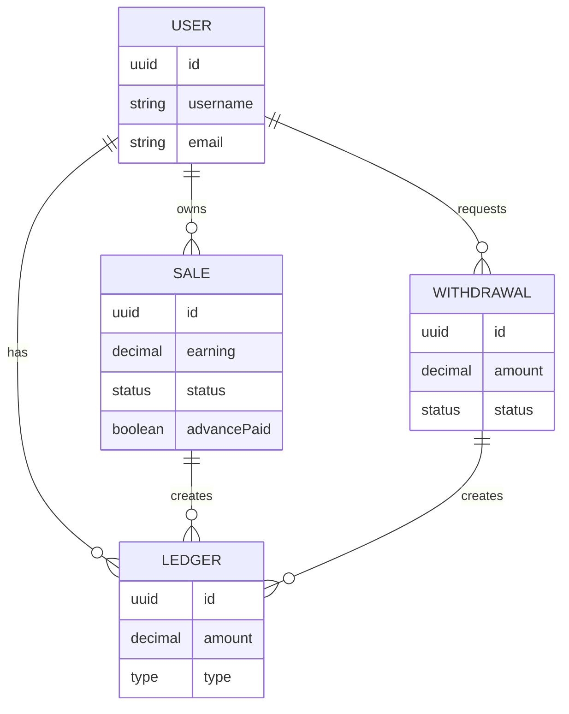
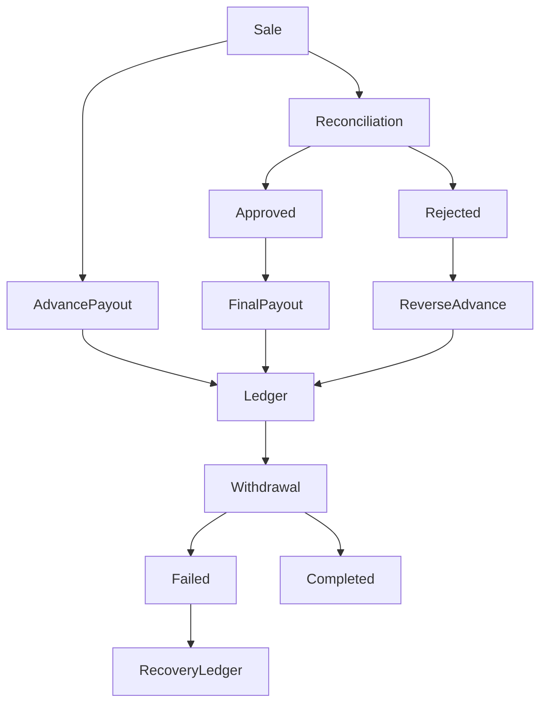

# User Payout Management System

## Overview

This project is a backend service that manages affiliate earnings and user payouts.

The system allows:

- User registration
- Sale creation
- Automatic advance payouts
- Sale reconciliation
- Withdrawal requests
- Ledger-based balance calculation

Instead of storing user balances directly, every financial operation is recorded in a Ledger. The available balance is calculated from ledger entries, providing an auditable and consistent financial system.

## High-Level Architecture

## Layer Responsibilities

### Routes

Maps HTTP endpoints to controllers.

### Middleware

Validates incoming requests using Zod.

### Controllers

Accept HTTP requests and return responses.

Controllers contain no business logic.

### Services

Contain business rules.

Examples:

- Advance payout calculation
- Withdrawal restriction
- Sale reconciliation

### Repositories

Only interact with Prisma.

No business logic exists here.

### Database

PostgreSQL stores application data.

## Database Schema

## Financial Flow

## Request Lifecycle

POST /api/sales

↓

Express Router

↓

Validation Middleware

↓

Controller

↓

Service

↓

Repository

↓

Prisma

↓

PostgreSQL

↓

HTTP Response

## Transaction Management

Financial operations use Prisma transactions.

Transactions are used in:

- Advance payout
- Withdrawal creation
- Withdrawal recovery
- Sale reconciliation

This guarantees that either all related database operations succeed together or none are committed.

## Why a Ledger?

Instead of storing a mutable user balance, every financial event is stored as a ledger entry.

Advantages

- Complete audit history
- Easy recovery
- Prevents balance inconsistencies
- Financial transparency
- Supports future reporting

## Future Improvements

- JWT Authentication
- BullMQ background jobs
- Scheduled payout worker
- Redis caching
- Docker deployment
- Kubernetes
- CI/CD